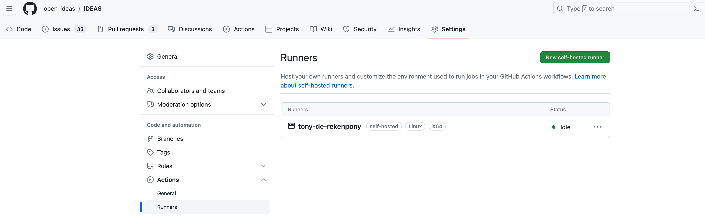
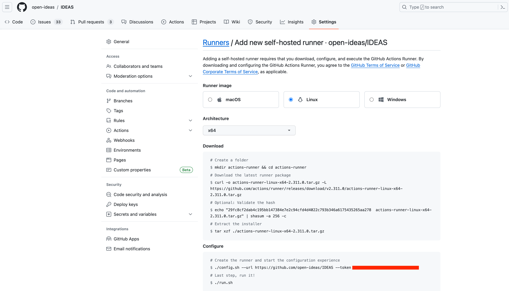
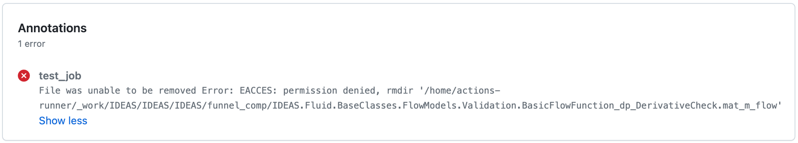

IDEAS testing framework
============

The IDEAS testing framework relies on [BuildingsPy](https://simulationresearch.lbl.gov/modelica/buildingspy/) to 
implement regression testing on example models of the library. 
A Docker image with Dymola (`dymimg`) is defined to encapsulate all dependencies and consistently run the tests either 
locally or in the server. 
The testing framework automates the tests using GitHub Actions with a self-hosted runner of the Sysi Team at KU Leuven called 
*blizz* (from *blizzard-the-calculation-wizard*). 
The tests used to run in Travis, but a major refactoring was implemented in 
[this PR](https://github.com/open-ideas/IDEAS/pull/1319) to benefit from the free-tier of GitHub Actions.
The Travis files are still in the library for legacy but may be removed in the near future. 

The core components of the testing framework are:
- **Dockerfile** (in `IDEAS/Resources/Scripts/tests/`): defines the Docker image with all software dependencies needed 
to run the tests. The major ones are Dymola and BuildingsPy. 
- **Makefile** (in `IDEAS/Resources/Scripts/tests/`): provides a series of shortcuts with the main commands to implement 
the tests. 
- **runUnitTests.py** (in `bin/`): main script to run the tests. 
- **github-actions.yml** (in `IDEAS/.github/workflows/`): defines the jobs to automatically trigger the tests in the 
server. 

## Running tests in GitHub Actions 
The tests in GitHub Actions are automatically triggered with every push in a pull request. Hence, the user does not 
have to do anything to start the tests other than openning a pull request and pushing to its associated branch. 
Note that the tests will be triggered also for pull requests across forks. 

Two jobs are defined in the `github-actions.yml` file: *build* and *test*. The *build* job simply checks out the 
repository code. The *test* job goes through each of the library packages in different steps to simulate the models and 
compare against reference results. 
Notice that the jobs and steps are defined in the `github-actions.yml` file and that every step explicitly sets 
`INTERACTIVE=false` to run the tests in 
''batch mode'', that is, no new reference results are generated since we are only interested in checking whether tests 
pass when running in the server. 
It is possible to generate new reference results and visually compare trajectories with previous references when running 
the tests locally.

## Running tests locally
The requirements to run tests locally are:

- **Docker**: to spin the containers where the tests run. 
- **Make**: to invoke the make commands from the `Makefile`. This is trivial for Mac and Linux OS, but you may need to 
install some make proxy if you are working in Windows. 
- **A Dymola installation file and license**: Dymola is commercial software and as such we cannot distribute it. 
You may work with a standalone license or with a pool license. If you are working with the pool license at KU Leuven, 
you need to connect to the B-Zone for the license to access the server.

The steps to run the tests locally are:

### 1. Set working directory
Change working directory to tests folder:
```bash
cd /IDEAS/Resources/Scripts/tests
```

### 2. Set environment variables 
The Dockerfile assumes that the following envrionment variables are set:
- `DYMOLAPATH`: points to a directory that contains the Dymola zip installation file and the `dymola.lic` license file.
- `DYMOLAFILE`: name of the Dymola zip installation file within the `DYMOLAPATH` directory.
- `DYMOLAVERSION` specifies the Dymola version.

For example, you can set these environment variables as follows (note that the specific path, file name and version may 
change in your case):
```bash
export DYMOLAPATH=/path/to/dymola/folder
export DYMOLAFILE=Dymola_2024x.AM_CAT_Dymola.Linux64.1-1.zip
export DYMOLAVERSION=dymola-2024x-x86_64
```

### 3. Build the image
Build the `dymimg` image where tests will run:
```bash
make build
```

### 4. Run the test. 
In this case it is set `INTERACTIVE=true` by default. Hence, you only need to specify the package you would like to 
test. For example:
```bash
make test-dymola PACKAGE=\"IDEAS.Examples.PPD12\"
```

### 5. Update references 
Update reference results if needed. When reference result trajectories of some tested models are not exactly the same as 
what they used to be, you will be prompted with a dialog that gives you the option to overwrite them with the new 
simulated trajectories. 

### 6. Compare 
Compare the old references with the new trajectories if needed. Once reference results are updated you can inspect the 
differences with the old trajectories by running the `IDEAS/compare_results.py` script. This file looks into the 
`IDEAS/funnel_comp` auxiliary folder that is created to plot simulation trajectories.

## Developing new tests
As a developer, you may want to implement a new test of a model that you have created. For that, you just need to add a 
new `.mos` file to the `IDEAS/Resources/Scripts/Dymola` directory. Please note that this directory is 
mirroring the structure of the IDEAS library. The new `.mos` file should indicate the model to be simulated,
the start and stop simulation time, and the most relevant variables to be checked. 
The convention is that any variables or parameters that are plotted by these `.mos` files are subject to regression 
testing. 

The tests can be further configured using the 
`IDEAS/Resources/Scripts/BuildingsPy/config.yml` file. See 
[here](https://simulationresearch.lbl.gov/modelica/buildingspy/development.html#module-buildingspy.development.regressiontest) 
for more information on how to define the `.mos` files and the `config.yml` file.
Once the `.mos` file is ready, you just need to run the tests for the package that contains the new model as indicated
in the previous section (*Running tests locally*).
BuildingsPy will detect that there is not yet any reference result for the new model and will give you the option to 
automatically generate one. The reference results are stored as `.txt` files within 
`IDEAS/Resources/ReferenceResults/Dymola`.


## Setting up the private runner
A *runner* is the platform where the tests actually run. This repository uses a private runner, that is, a self-hosted server 
of the Sysi Team at KU Leuven called *blizz* (from *blizzard-the-calculation-wizard*).
[Here](https://docs.github.com/en/actions/hosting-your-own-runners) you can find general information about self-hosted runners 
with GitHub Actions. Normally, the runner is continuously active and listening for new test requests. However, here we specify 
the steps to restart the private runner in case the server needs to be rebooted and for the information of new people who need 
to take over maintenance of the testing suite. 

- In GitHub, go to Settings - Actions - Runners. When the runner is active and properly configured, it looks as follows:

- To remove the runner (e.g. because it's not working properly), click the three dots and select "Remove runner". 
- To add a new runner (because it's not showing up or because you've just removed it), click on the "New self-hosted runner" 
green button. Make sure you select the Linux configuration with x64 architecture. You may not need to go through the steps 
at the "Download" section unless you want to reinstall the GitHub Actions runner client functionality. If you want to skip 
the "Download" section, go straight ahead to the "Configure" Section to configure and activate the runner.  

- More specifically, we typically use the following commands:
```
cd /home/actions-runner
nohup ./run.sh &
```
Where [`nohup`](https://www.digitalocean.com/community/tutorials/nohup-command-in-linux) allows you to run a command even 
if you close the terminal. 
The [`&` symbol](https://www.digitalocean.com/community/tutorials/nohup-command-in-linux#starting-a-process-in-the-background-using-nohup) 
tells the command to run in the background, the output will be redirected to a `nohup.out` file. 
- If when running the tests you keep getting errors of the type:

You may want to remove the contents from the `_work` directory to start from a clean workspace. 
Not removing the `_work` directory could lead to permission errors when running the unit tests after reconfiguration
You can remove such directory as follows:
```
cd /home/actions-runner
rm -rf _work
```
This folder will be recreated by GitHub Actions upon checking out the repository code to run the tests.  