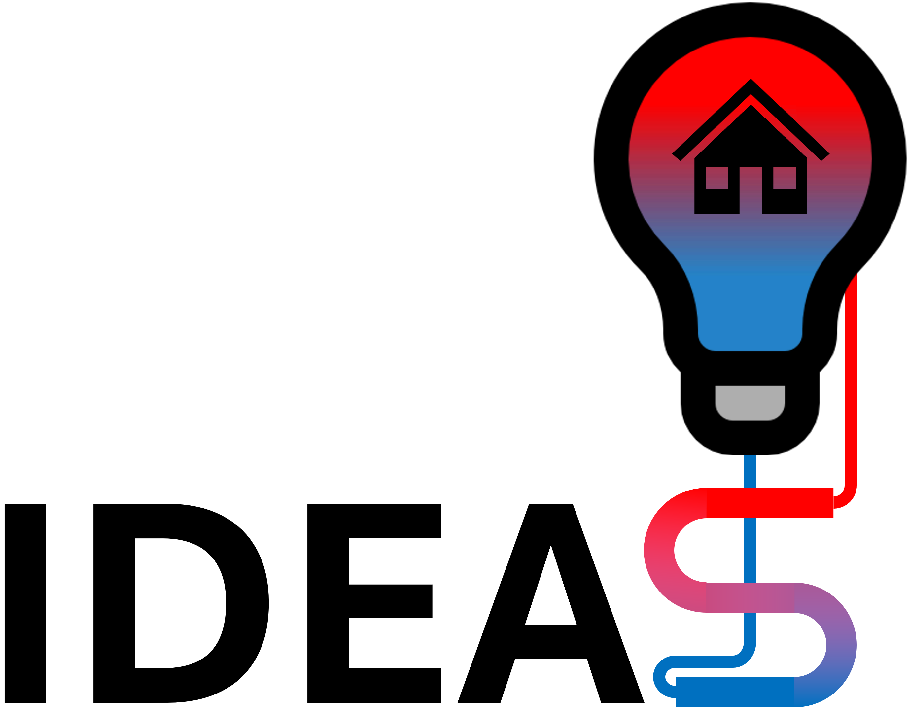
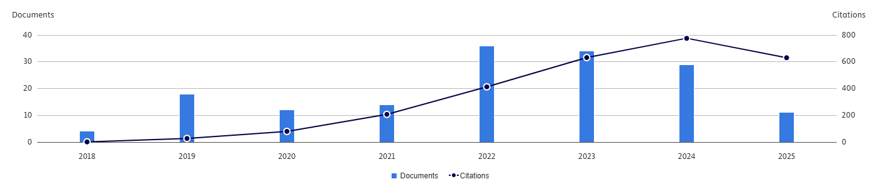

<div align="center">
<picture>
  <source media="(prefers-color-scheme: dark)" srcset="IDEAS/Resources/Images/IDEAS-logo-dark.png" style="height:120px;">
  <source media="(prefers-color-scheme: light)" srcset="IDEAS/Resources/Images/IDEAS-logo-light.png" style="height:120px;">
  
</picture>
<b>v3.0.0</b>
</div>
<br/>

IDEAS is a <i>Modelica</i> library for <b>I</b>ntegrated <b>D</b>istrict <b>E</b>nergy <b>A</b>ssessment <b>S</b>imulations. 
This free and open-source library enables simultaneous transient simulation of integrated thermal and electrical energy systems
including buildings at both individual (building) and collective (district) level.

The IDEAS library extends from the [Modelica IBPSA library](https://github.com/ibpsa/modelica-ibpsa) and has a particular focus
on the development of detailed building models. It is one of the four sister libraries that extend from the core Modelica IBPSA
library, alongside [AixLib](https://github.com/RWTH-EBC/AixLib), [Modelica Buildings](https://github.com/lbl-srg/modelica-buildings),
and [BuildingSystems](https://github.com/UdK-VPT/BuildingSystems).

## License
IDEAS is licensed by [KU Leuven](http://www.kuleuven.be) and [3E](http://www.3e.eu) under a 
[BSD 3 license](https://htmlpreview.github.io/?https://github.com/open-ideas/IDEAS/blob/master/IDEAS/legal.html).

## Community and contributions
We love to hear what you are using IDEAS for. You are welcome to open an issue on GitHub or contact the development team via
email to share your feedback. If you like our library, you can support IDEAS by starring it at the top right of our Github page.
Bug reports and feature suggestions can be submitted as [GitHub issues](https://github.com/open-ideas/IDEAS/issues), and
contributions in the form of [pull requests](https://github.com/open-ideas/IDEAS/pulls) are highly encouraged. Before submitting
a pull request, please consult the the IDEAS
[Style Guide and Conventions](https://github.com/open-ideas/IDEAS/wiki/Style%20Guide%20and%20GitHub%20Good%20Practice)
to ensure consistency with the project's conventions.

The IDEAS library was originally developed by KU Leuven and [3E](https://3e.eu), and is currently developed and maintained by
the [Thermal Systems Simulation (The SySi)](http://the.sysi.be) research group of KU Leuven. 
The library includes significant contributions by the [Building Physics and Sustainable Design Section](https://bwk.kuleuven.be/bwf)
of KU Leuven, the [Building Physics Research Group](https://www.ugent.be/ea/architectuur/en/research/research-groups/building-physics)
of UGent, [IBPSA project 1](https://ibpsa.github.io/project1/), [IEA EBC Annex 60](https://iea-annex60.org) and the
[Electrical Energy Systems and Applications Section](https://www.esat.kuleuven.be/electa) of KU Leuven.

## Tool support
IDEAS is largely compliant with the [Modelica Specification](https://specification.modelica.org/), and is therefore, in
principle, compatible with any simulation tool that supports this standard, such as Dymola or OpenModelica. However, as
IDEAS is primarily developed and maintained in Dymola, and the unit testing framework is exclusively implemented in Dymola,
certain compatibility issues with alternative tools may arise. Users are encouraged to report any deviations from the Modelica
specification or tool-specific issues so that these can be addressed in future updates.

## Unit testing
Unit testing is performed using Dymola in combination with BuildingsPy. Automated unit tests are executed via GitHub Actions,
utilising a self-hosted runner maintained by KU Leuven. Further information on the IDEAS unit testing framework is available
on the [IDEAS Wiki](https://github.com/open-ideas/IDEAS/wiki).

## Getting started
Two tutorials are provided in <code>IDEAS.Examples.Tutorial</code>, serving as demonstrations cases of how the IDEAS library
can be used.
1. <code>IDEAS.Examples.Tutorial.SimpleHouse</code> contains examples with step-by-step instructions for how to build a system
model for a simple house with a heating system, ventilation, and weather boundary conditions. This tutorial does not use the
detailed IDEAS building envelope components, but instead includes a very simple Resistance-Capacitance (RC) model. 
2. <code>IDEAS.Examples.Tutorial.DetailedHouse</code> contains examples with step-by-step instructions for how to build a system
model for an office building (using the detailed building envelope component models within IDEAS.Buildings) with occupants, a
radiator heating system connected to a heat pump, and a ventilation system.

Furthermore, 
- <code>IDEAS.Buildings.Examples</code> and <code>IDEAS.Buildings.Components.Examples</code> contain examples focussing on the
building models, including individual features, developed in this library.
- <code>IDEAS.Examples.IBPSA</code> collects some models used in [BOPTEST](https://github.com/ibpsa/project1-boptest).
- <code>IDEAS.Examples.PPD12</code> is an example model of a terraced house, including a heating and ventilation system.
- <code>IDEAS.Examples.TwinHouses</code> is a model of the Holzkirchen twin house, used in a validation experiment.
 
See the documentation sections of the respective packages and models for more information.

## Citing IDEAS
Please cite IDEAS using the reference provided below.

```
@article{Jorissen2018ideas,  
author = {Jorissen, Filip and Reynders, Glenn and Baetens, Ruben and Picard, Damien and Saelens, Dirk and Helsen, Lieve},  
journal = {Journal of Building Performance Simulation},    
title = {{Implementation and Verification of the IDEAS Building Energy Simulation Library}},  
volume = {11},
issue = {6},  
pages = {669-688},
doi={10.1080/19401493.2018.1428361},  
year = {2018}  
}
```

## Release history
IDEAS v3.0.0 was released on May 3, 2022. This release includes an update to the Modelica Standard Library MSL 4.0.0.
Detailed release notes are available within the library under the following link:
[ReleaseNotes](https://github.com/open-ideas/IDEAS/tree/master/IDEAS/UsersGuide/ReleaseNotes).
Notes for the previous releases notes can also be found there. 

## Documentation
The IDEAS library offers comprehensive documentation. Each model includes a dedicated documentation section explaining its implementation details.
Many models also reference relevant scientific papers. An overview of the key reference papers is provided in the
[References](https://github.com/open-ideas/IDEAS/blob/master/IDEAS/UsersGuide/References.mo) section of the
[User's Guide](https://github.com/open-ideas/IDEAS/tree/master/IDEAS/UsersGuide).

## Applications of IDEAS
IDEAS is widly used across various applications. To gain an overview of how the library has been applied, please consult the
[citations](https://www.tandfonline.com/doi/citedby/10.1080/19401493.2018.1428361) of the reference paper.
<div align="center">

</div>


